<div align="center">



<br/>

[](https://nicolas-ramirez.dev)
[](https://www.linkedin.com/in/nicolas-francisco-ram%C3%ADrez-sandoval/)
[](mailto:n2.9ramirez@gmail.com)

</div>

<br/>

```
 → building production systems with typescript, react, next.js and postgresql
 → focused on maintainability over cleverness, security by default
 → founder of nfr innovaciones web spa · ing. civil informática @ upla
```

---

### `// what i'm building`

<table>
<tr>
<td width="50%">

**[EMIT](https://emitr.cl)** `pre-launch`
<br/>
Shopify → SII automation for Chilean merchants.
Auto-generates boletas, facturas & notas de crédito per sale.
<br/><br/>
`Next.js 15` `Drizzle` `Neon` `Clerk` `Stripe` `pg-boss`

</td>
<td width="50%">

**CECOM** `production`
<br/>
Multi-tenant operational management for mining & industrial sites.
Real-time emergency dispatch, shift handover with digital signatures.
<br/><br/>
`React 18` `Socket.io` `Express` `PostgreSQL` `AWS`

</td>
</tr>
<tr>
<td width="50%">

**Auditly** `in development`
<br/>
Digital checklists & audit SaaS for LatAm SMBs.
Template builder, inspection flows, compliance scoring.
<br/><br/>
`Next.js 15` `Prisma` `Neon` `Clerk` `shadcn/ui`

</td>
<td width="50%">

**SINTRA** `shipped`
<br/>
Firefighter management platform.
Migrated from monolith to multi-tenant architecture.
<br/><br/>
`React 19` `Express` `MySQL` `Prisma`

</td>
</tr>
<tr>
<td width="50%">

**[CONAF Dashboard](https://conaf-dashboard.vercel.app)** `deployed`
<br/>
Emergency operations center for forest fire dispatch.
Map-centric layout with real-time KPIs.
<br/><br/>
`React` `Vite` `Leaflet` `Vercel`

</td>
<td width="50%">

**[nicolas-ramirez.dev](https://nicolas-ramirez.dev)** `live`
<br/>
Personal portfolio. Nothing-inspired design,
bilingual EN/ES, JSON-LD SEO.
<br/><br/>
`Next.js 15` `Tailwind` `Vercel`

</td>
</tr>
</table>

---

### `// stack`

<div align="center">


</div>

---

### `// stats`

<div align="center">

<picture>
  <source media="(prefers-color-scheme: dark)" srcset="https://github-readme-stats.vercel.app/api?username=nicolasov2&show_icons=true&include_all_commits=true&count_private=true&bg_color=000000&title_color=ff2d00&text_color=888888&icon_color=ff2d00&border_color=222222&hide_border=false&ring_color=ff2d00" />
  <source media="(prefers-color-scheme: light)" srcset="https://github-readme-stats.vercel.app/api?username=nicolasov2&show_icons=true&include_all_commits=true&count_private=true&bg_color=ffffff&title_color=ff2d00&text_color=333333&icon_color=ff2d00&border_color=e0e0e0&hide_border=false" />
  
</picture>
&nbsp;&nbsp;
<picture>
  <source media="(prefers-color-scheme: dark)" srcset="https://streak-stats.demolab.com?user=nicolasov2&background=000000&ring=ff2d00&fire=ff2d00&currStreakLabel=ff2d00&sideLabels=888888&sideNums=ffffff&currStreakNum=ffffff&dates=444444&border=222222" />
  <source media="(prefers-color-scheme: light)" srcset="https://streak-stats.demolab.com?user=nicolasov2&background=ffffff&ring=ff2d00&fire=ff2d00&currStreakLabel=ff2d00&sideLabels=333333&sideNums=000000&currStreakNum=000000&dates=888888&border=e0e0e0" />
  
</picture>

</div>

<br/>

<div align="center">

<picture>
  <source media="(prefers-color-scheme: dark)" srcset="https://github-readme-stats.vercel.app/api/top-langs/?username=nicolasov2&layout=compact&bg_color=000000&title_color=ff2d00&text_color=888888&border_color=222222&langs_count=8" />
  <source media="(prefers-color-scheme: light)" srcset="https://github-readme-stats.vercel.app/api/top-langs/?username=nicolasov2&layout=compact&bg_color=ffffff&title_color=ff2d00&text_color=333333&border_color=e0e0e0&langs_count=8" />
  
</picture>

</div>

---

<div align="center">

```
 nicolás ramírez · valparaíso, chile · 2026
```

</div>
